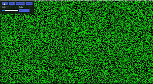

# GameOfLife
Conway's game of life implemented with Javascript using canvas.

[View Example](https://theithorian.github.io/Game-Of-Life/)

Learn more on the game of life here: https://en.wikipedia.org/wiki/Conway%27s_Game_of_Life

## Controls
* Click on the page to toggle the status of a cell
* `Start` - Starts the simulation
* `Step` - Move one step in the simulation
* `Randomise` - Randomise the entire canvas
* `Refresh` - Resets the page
* `Scale` - Sets the size of the cells
* `Delay` - Changes the speed of the simulation

## Demo

